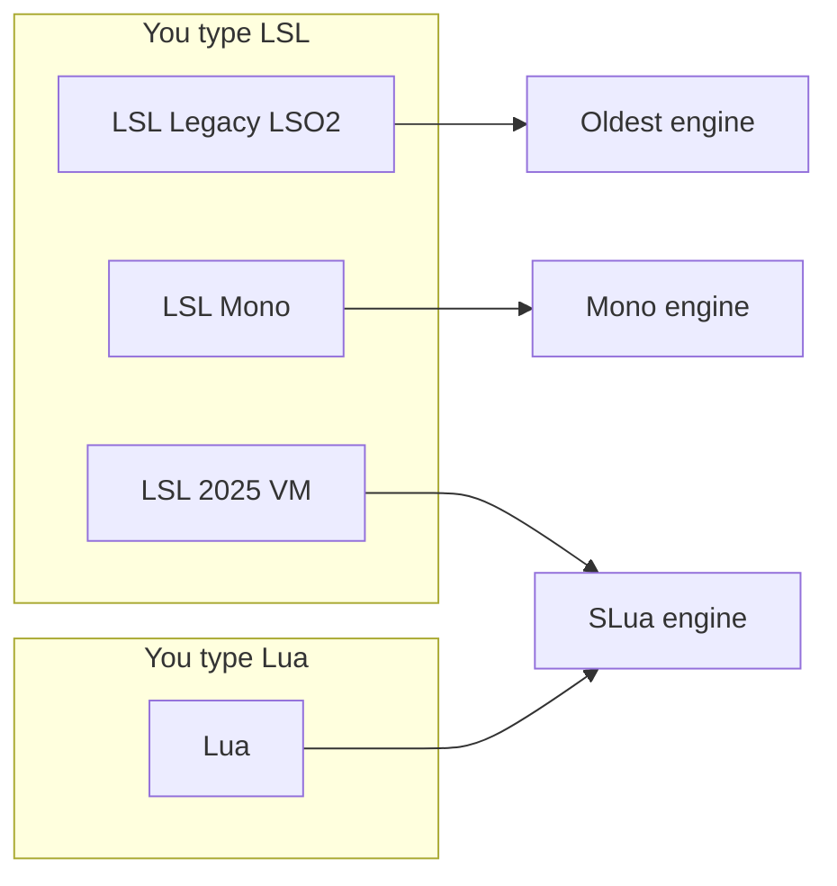
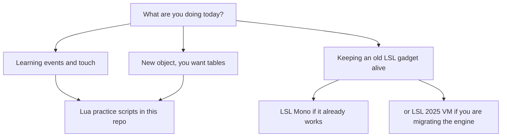

# Compiler and Memory Card

The chart people ask for after the second cup of coffee.

Practice notes only. Official Linden Lab pages win if a number here moves.
SLua is still growing. Memory accounting has been rewritten more than once.

## The four buttons

| Dropdown | Language you type | Engine | Everyday take |
|---|---|---|---|
| LSL: Legacy (LSO2) | LSL | LSO2 | Tiny old world. Leave it unless a vendor or ancient gadget needs it. |
| LSL: Mono | LSL | Mono | The 64 KB neighborhood most existing content still lives in. |
| LSL: 2025 VM | LSL | SLua engine | Same LSL habits, newer engine. Useful when you are not ready to learn Lua yet. |
| Lua | Lua / Luau | SLua engine | New syntax. Tables, extra timers, callbacks. |

Same object can hold LSL scripts and Lua scripts together.
One file cannot be both languages.

## Memory, said softly

Published figures have been:

| World | Ballpark ceiling | How to think about it |
|---|---|---|
| LSO2 | about 16 KB | Museum piece. |
| Mono | 64 KB | The number most scripters still dream in. |
| Lua / SLua | about 128 KB on paper | More room. Not infinite. Tables can jump. |
| LSL: 2025 VM | SLua engine under LSL text | Do not assume Mono's old "how big is my list" instincts still match. |

Treat those numbers as **orientation**, not a contract. Linden has changed how memory is counted during alpha and beta. `ll.GetFreeMemory()` has not always told the story people expected.

## Practical advice that stays true even if the numbers move

1. **Do not pack a novel into script memory** if Linkset Data can hold the settings.
2. **Growing tables are the usual surprise.** A practice config with five keys is friendly. A table you append forever is how you meet the ceiling.
3. **One fat script is not always cheaper** than a few small ones. It is just easier to read until it is not.
4. **LSL: 2025 VM is a bridge**, not a personality test. Use it when the object should stay LSL.
5. **Lua is worth it** when you want tables, more than one timer, or you are starting fresh.

## When to pick what, for BB students

## Official doors

- https://wiki.secondlife.com/wiki/Lua_Alpha
- https://create.secondlife.com/script/
- https://github.com/secondlife/lsl-definitions (`lsl_definitions.yaml` and `slua_definitions.yaml`)

Builders Brewery Sandbox is the classroom annex. Official pages win arguments.
