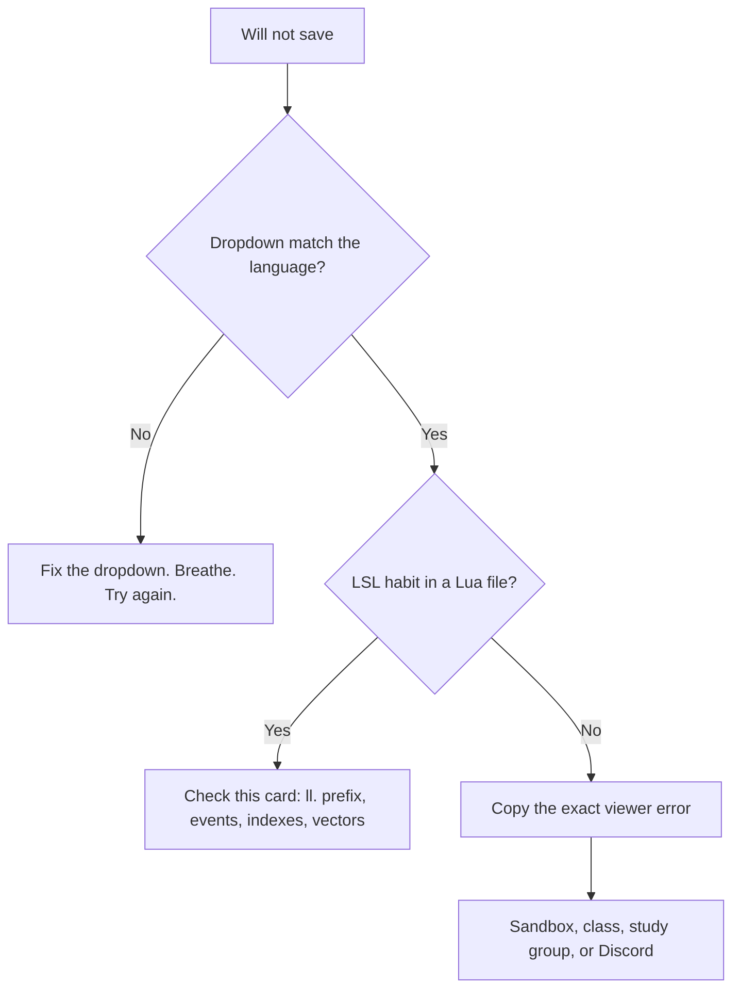

# SLua Gotchas Card

The viewer is not mad at you. It is just picky.

This is a practice decoder, not official Linden Lab documentation.
If anything here disagrees with [create.secondlife.com/script](https://create.secondlife.com/script/) or the [Lua wiki](https://wiki.secondlife.com/wiki/Lua_Alpha), trust those.

SLua is based on **Luau**. That is the language, not the feast.

## First, check the dropdown

Most "this language is broken" moments are the compiler dropdown.

| You typed | Dropdown should say |
|---|---|
| `default { touch_start(...) }` and `llSay` | one of the **LSL:** options |
| `LLEvents:on` and `ll.Say` | **Lua** |

You can mix an LSL script and a Lua script **in the same object**.
You cannot mix both languages **in the same script file**.

## The decoder

| What you typed or saw | What it usually means | Try this |
|---|---|---|
| `llSay` will not save in a Lua script | Functions live under `ll.` now | `ll.Say(0, "Hi")` |
| `touch_start` as a free-floating function does nothing | After the late-2025 API shift, global event functions are not the path | `LLEvents:on("touch_start", function(detected) ... end)` |
| `Hello, ` + name | Lua does not add strings with `+` | `` `Hello, {name}` `` or `"Hello, " .. name` |
| `x++` | No increment operator | `x += 1` |
| `<0, 0, 1>` | No angle-bracket vector literals | `vector(0, 0, 1)` |
| `llDetectedName(0)` | Detection is 1-based and object-like | `detected[1]:getName()` |
| `TRUE` / `FALSE` | Lua booleans are lowercase | `true` / `false` |
| `if (x) { }` | No curly-brace blocks | `if x then ... end` |
| `state_entry` never runs | SLua does not gift you that event the LSL way | Write a setup function and **call it** at the bottom |
| First list item missing / off by one | Lua tables start at **1** | `names[1]`, not `names[0]` |
| Script saved as LSL: 2025 VM but uses `LLEvents` | 2025 VM still wants **LSL text** | Switch the dropdown to **Lua** |
| Memory climbed faster than you expected | Tables and growing lists are not free | Keep practice tables small. Stash bulk data in Linkset Data. |
| `uuid("not-a-key")` gave you `nil` | Invalid ids do not pretend to be keys | Check before you use it |

## Event shape we use on this bench

```lua
LLEvents:on("touch_start", function(detected)
    local name = detected[1]:getName()
    ll.Say(0, `Hello, {name}`)
end)
```

Official examples also show typed handlers such as `function(detected: {DetectedEvent})`.
Both spellings have appeared while SLua grows. If the viewer refuses to save, follow the spelling your current BB class and the official portal are using that week.

## A tiny flowchart for "it will not save"



## What is *not* a gotcha

- Wanting LSL still. That is allowed. LSL is not being sent to a farm upstate.
- Using **LSL: 2025 VM** so your old LSL runs on the newer engine. That is a real option.
- Asking a human. That is the BB method.

## Official doors

- Creator portal: https://create.secondlife.com/script/
- Wiki: https://wiki.secondlife.com/wiki/Lua_Alpha
- FAQ: https://wiki.secondlife.com/wiki/Lua_FAQ
- Official definitions: https://github.com/secondlife/lsl-definitions
- Official VS Code plugin: https://github.com/secondlife/sl-vscode-plugin

Next: [COMPILER_AND_MEMORY_CARD.md](COMPILER_AND_MEMORY_CARD.md) and the [Pocket Map](SLUA_POCKET_MAP.md).
