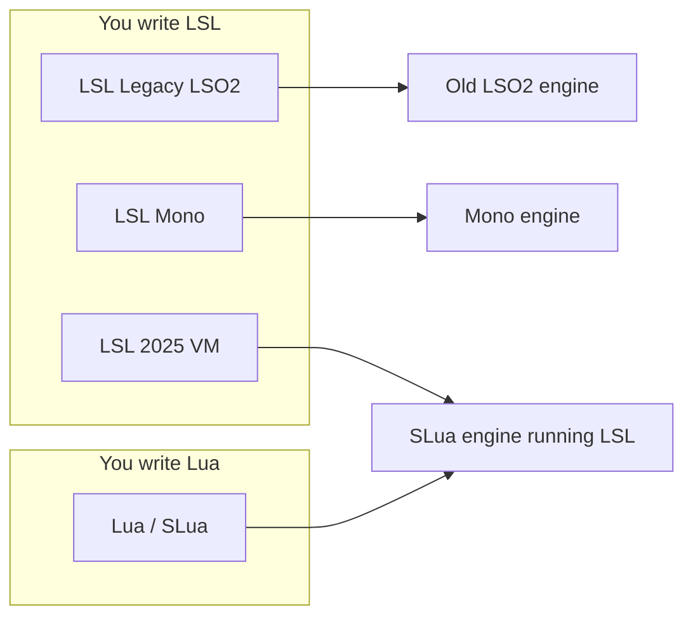
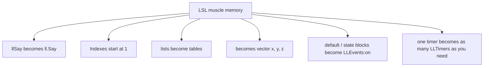
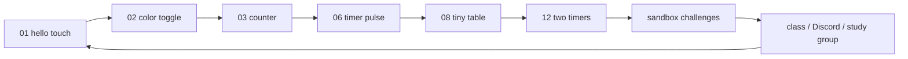

# SLua Pocket Map

A one-sitting picture of how SLua sits next to LSL.

This is a practice map, not a class packet and not official Linden Lab documentation.
If anything here disagrees with [create.secondlife.com/script](https://create.secondlife.com/script/) or the [Lua wiki pages](https://wiki.secondlife.com/wiki/Lua_Alpha), trust those.

SLua is based on **Luau**. That is the language, not the feast.

## The four compiler buttons

This is the chart people actually need on day one.



| Dropdown | Language you type | Engine that runs it | Everyday take |
|---|---|---|---|
| LSL: Legacy (LSO2) | LSL | Oldest VM | Tiny memory. Leave it unless you have a reason. |
| LSL: Mono | LSL | Mono | The familiar 64 KB world most content still uses. |
| LSL: 2025 VM | LSL | SLua engine | Same LSL habits, newer engine, usually leaner. |
| Lua | Lua / Luau | SLua engine | New syntax. Tables, extra timers, callbacks. |

You can mix LSL scripts and Lua scripts **in the same object**. You cannot mix both languages **in the same script file**.

## What actually changes when you switch languages



## Event shape

LSL waits in a `default` state for the world to poke it.

SLua signs up for the poke.

```lua
-- SLua shape used in the BB practice scripts
LLEvents:on("touch_start", function(detected)
    local name = detected[1]:getName()
    ll.Say(0, `Hello, {name}`)
end)
```

`state_entry` is not a freebie the way it is in LSL. If you write a startup function, call it yourself at the bottom of the script.

Official docs also show typed handlers such as `function(detected: {DetectedEvent})`. Both spellings have appeared while SLua grows. If the viewer refuses to save, follow the spelling your current class and the official portal are using that week.

## Types at a glance

| LSL | SLua | Watch your fingers |
|---|---|---|
| `integer` / `float` | `number` (plus a distinct integer when the LSL API needs one) | No `x++`. Use `x += 1`. |
| `string` | `string` | Join with `..` or `` `Hi {name}` ``. Do not use `+`. |
| `key` | uuid / string-shaped id | Still an id. Do not treat it like a pretty name. |
| `vector` | `vector(x, y, z)` | No angle-bracket literals. |
| `rotation` | `rotation(x, y, z, s)` | Same idea. |
| `list` | `table` `{ }` | First item is `[1]`, not `[0]`. |
| `TRUE` / `FALSE` | `true` / `false` | Lowercase. |

## Why tables feel like a gift

LSL made you keep parallel lists and count in threes. SLua lets one table hold the whole recipe.

```lua
local config = {
    channel = 5,
    range = 10.0,
    greeting = "Welcome to the bench.",
}
```

When you need to talk to an LSL-style function that still wants a list, you still pass a table. Build it carefully. Tables can jump in memory size as they grow. That is a known sharp edge. Keep practice tables small.

## New toys worth tasting (after hello-touch works)

- **Several timers** with `LLTimers:every(...)`
- **String interpolation** `` `Hello, {name}` ``
- **JSON** with `lljson.encode` / `lljson.decode` when you want to stash a table in Linkset Data
- **Coroutines** when you want a pause without inventing a state machine (taste this in class, not on day one)
- **bit32** when you miss bitwise tricks

## Practice path that stays fun



Ten minutes. One file. One change. Then walk away or come ask a human.

## Official doors

- Creator portal: https://create.secondlife.com/script/
- Wiki overview: https://wiki.secondlife.com/wiki/Lua_Alpha
- FAQ: https://wiki.secondlife.com/wiki/Lua_FAQ
- Official definitions: https://github.com/secondlife/lsl-definitions (`lsl_definitions.yaml` and `slua_definitions.yaml`)
- Official VS Code plugin: https://github.com/secondlife/sl-vscode-plugin

Builders Brewery Sandbox is the classroom annex. Official Linden Lab pages win arguments.
